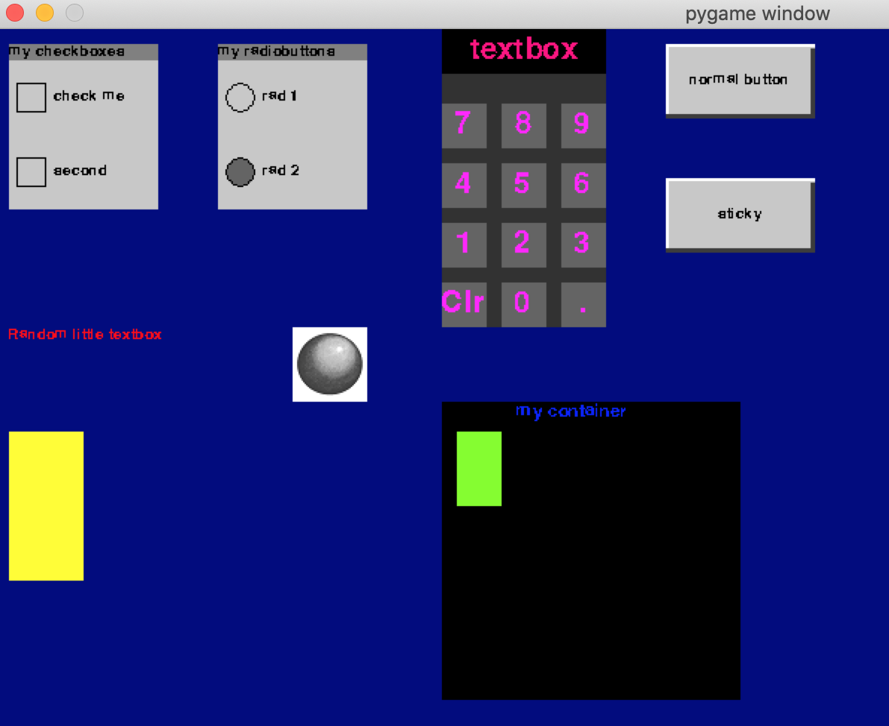

# pyGUIme

Pyguime is a simple GUI framework for [pygame](http://pygame.org).

The framework can be used to create a *simple* GUI, suitable for
for use on little Raspberry Pi touchscreens and similar devices. The
original use case is to create GUIs for simple Arduino projects, but
other uses are possible.

It is *not* intended to be a fully fledged GUI replacement, but it
also isn't as complicated to use as some other packages.


### Sample widgets




# Limitations

PyGUIme currently does not handle keyboard input at all. If you have
keyboard input to handle, please use the normal pygame functionality.
The reason for this is because the touch screens I play with don't have
a keyboard. 

Feel free to submit a PR with keyboard callbacks added - it would probably
be a useful addition!


# License

Pyguime is licensed under GNU Lesser General Public License v2.1. See the `LICENSE` file
for more information.


# Why pyGUIme

I have often found myself wishing there was a simple way of driving and
interacting with a touch screen interface from an Arduino. Whilst possible,
IMO I do not want to handle this on the Arduino at all - I want the Arduino
to be focused on handling other hardware I cannot easily interact with
from Python / Raspberry Pi's etc.

I originally started working on pyGUIme because I wanted to interact with
my [lathe electronic lead screw](https://github.com/hbilar/arduino-electronic-lead-screw)
long term project in a way that is difficult and cumbersome on the Arduino
itself. For my particular project, I need a keypad, various buttons,
updating text boxes etc. All this could be implemented on a simple LCD panel
with arrow keys, like I did in my
[fuel injector tester](https://github.com/hbilar/arduino-injector-tester/blob/master/src/fuel-injector-tester.cpp#L686-L803),
but it is just painful for anything that is more complicated than the fuel
injector tester.

## Why pygame?

I love the pygame library. It's simply fantastic for drawing stuff on the
screen with Python. For doing full screen graphics in Python, I can't think
of a nicer library (that I know of).


# Concepts and examples

## Main loop

The pyGUIme GUI is drawn onto a surface by the `pyguime.draw_widgets` function,
and events are handled by the `pyguime.handle_mouseclick_up` and
`pyguime.handle_mouseclick_down` functions. 

All these functions should be called in the appropriate section of the
main loop in the pygame program.

Pseudo code example:

```pythonstub
    pyguime_screen = pyguime.setup_screen(width=w, height=height)
    gui_surface = pygame.Surface((width, height)).convert()

    while running:
        # draw the pyGUIme widgets / GUI
        gui_surface = pyguime.draw_widgets(gui_surface, widgets)

        # Handle events (button presses etc)
        for event in pygame.event.get():

            # Check keyboard presses
            if event.type == pygame.MOUSEBUTTONUP:
                pyguime.handle_mouseclick_up(widgets, pygame.mouse.get_pos())
            elif event.type == pygame.MOUSEBUTTONDOWN:
                pyguime.handle_mouseclick_down(widgets, pygame.mouse.get_pos())

        # blit to screen
        pyguime_screen.screen.blit(gui_surface, (0, 0))
```


## Widgets

The basic object in pyGUIme is a `widget`. A widget is either something
you can interact with on screen, or a collection of other widgets
(a container).

The library defines a set of standard widgets, that can be extended, should
you wish to.

Widgets can have callbacks attached to them, so that when the user clicks
on e.g. a button (or indeed any `clickable` widget), a user defined function
is ran.

Widgets have a bunch of properties associated with them. These properties
are used to determine how to draw the widget, what should happen when it
is clicked, if it has child widgets inside it, etc etc.


